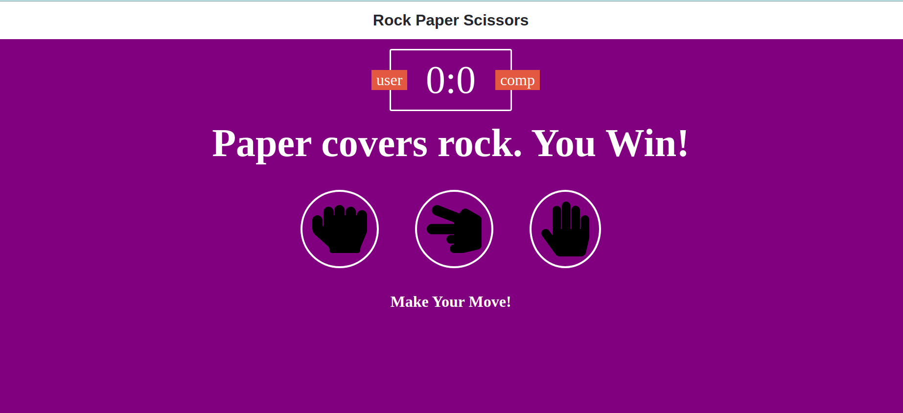

# Project: Rock-Paper-Scissors

> Project was about creating a game of rock, paper, scissors
> applying JavaScript concepts and ES6 syntax

## Built With

- CSS
- Javascript

## Live Demo

[Live Demo Link](https://cvilla714.github.io/rock-paper-scissors/)

## Getting Started

**To get a copy of the code please click on the green button on the top right corner that says Code**

### Install

**Now to clone it to your local machine please open your terminal and paste this code `git@github.com:cvilla714/rock-paper-scissors.git`**

**Then you can go into the directory by typig `cd rock-paper-scissors `**

### Usage

**Once you have gone through the process of installing the code you now you can use to open the index.html inside your editor with live-server to open the game in new tab in your web browser**

## Authors

👤 **Cosmel Villalobos**

- Github: [@cvilla714](https://github.com/cvilla714)
- Twitter: [@kckeyti](https://twitter.com/kckeyti)
- LinkedIn: [Cosmel Villalobos](https://www.linkedin.com/in/cosvilla/)

## 🤝 Contributing

Contributions, issues, and feature requests are welcome!

Feel free to check the [issues page](https://github.com/cvilla714/rock-paper-scissors/pulls).

## Show your support

Give a ⭐️ if you like this project!

## 📝 License

This project is [MIT](https://github.com/cvilla714/rock-paper-scissors/blob/master/LICENSE) licensed.
